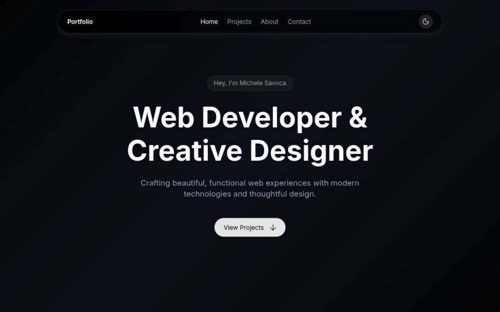

# Portfolio

This is my personal portfolio, designed and built by myself to present both my technical skills and my design approach in one product.

Built with **Next.js**, **React**, **TypeScript**, and **SCSS**, this project is a structured, component-driven frontend application that highlights how I approach interface design, reusable architecture, responsiveness, interaction details, and clean implementation.

## What this project showcases

### Strong personal branding
The site is intentionally designed as a professional presentation of my profile as a **Web Developer & Creative Designer**. The content, layout, visual hierarchy, and interactions are all tailored to communicate both personality and professionalism.

### Component-based architecture
The UI is built from reusable components such as `Box`, `Stack`, `Grid`, `Button`, `Typo`, `HeroSection`, `Project`, and `Icon`. This makes the codebase easier to scale, maintain, and evolve over time.

### Data-driven content
Project and skill content is separated from the UI and stored in JSON files. That keeps the presentation layer clean and makes updates fast and straightforward.

### Thoughtful user experience
The portfolio includes section-based navigation, animated scroll reveals, a mobile-friendly menu, smooth anchor navigation, and appearance handling for dark and light themes.

## Project structure

The codebase is organized to keep responsibilities clearly separated:

- `src/app` – application entry, layout, and page composition
- `src/components/Layout` – header, navigation, appearance controls, and shared layout behavior
- `src/components/ui` – reusable UI primitives and presentation components
- `src/assets` – project data, skills data, fonts, and SVG assets
- `src/hooks` – custom React hooks such as appearance handling
- `src/styles` – global styles, theme tokens, breakpoints, animations, and utility layers
- `src/scripts` – development utilities, including icon generation

This structure reflects a workflow focused on **clarity**, **separation of concerns**, and **long-term maintainability**.

## UI and design approach

The portfolio was designed by myself with a focus on a clean modern aesthetic. The visual system uses:

- custom typography
- spacing and sizing tokens
- light and dark theme support
- subtle glassmorphism-inspired surfaces
- motion and reveal animations to add depth without overwhelming the content

The goal was to create an interface that feels professional, elegant, and deliberate while still keeping the content easy to scan.

## Technical highlights

- **Next.js 16** for the application framework
- **React 19** for component composition
- **TypeScript** for stronger safety and maintainability
- **SCSS / CSS Modules** for modular styling
- **Vercel Analytics** and **Speed Insights** integration
- custom SVG icon pipeline for reusable icon components

## Why this portfolio matters

This project represents the way I like to build products: with equal attention to **code quality**, **design quality**, and **user experience**.

For employers, it is meant to demonstrate that I can:

- turn ideas into polished interfaces
- create structured, reusable frontend systems
- work comfortably with modern React and Next.js patterns
- design and develop in the same workflow
- build digital experiences that are both functional and visually refined

